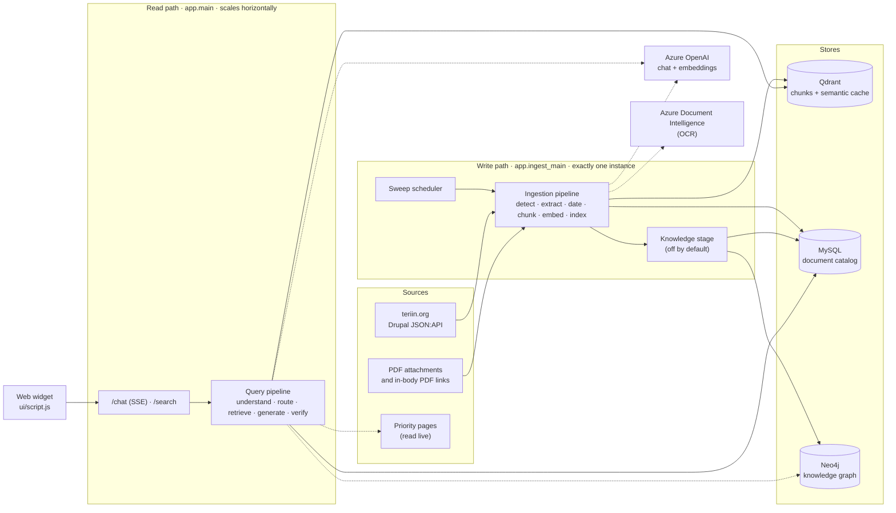
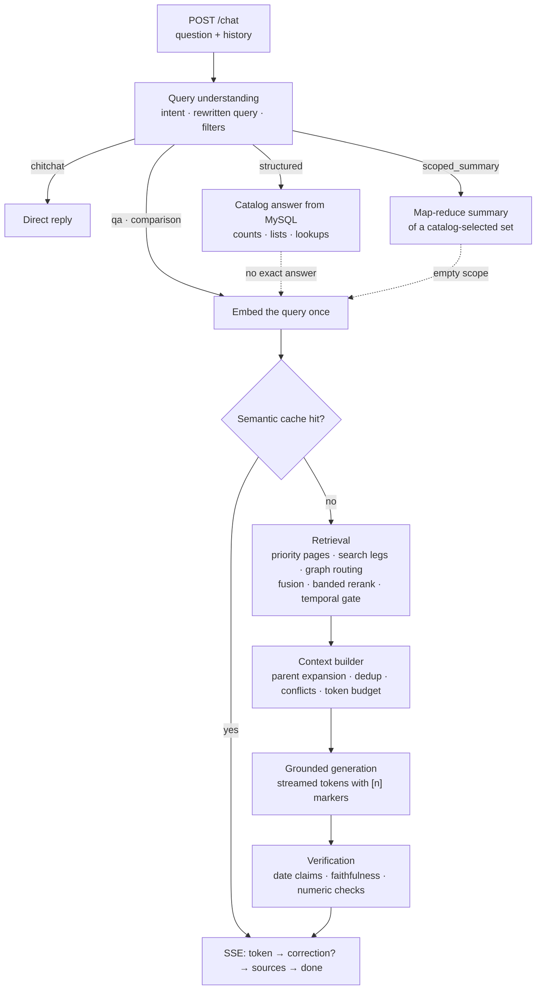

# Agentic RAG Chatbot — TERI AI Sarthi

A question-answering service over the [TERI](https://www.teriin.org) website and
the PDFs it publishes. It keeps a searchable copy of the site in step with the
live CMS, and answers questions from it with **grounded, cited answers**. Every
citation comes from the stored passage payload, never from the model.

The service is built with FastAPI. It runs as two servers that share one
codebase:

- an **ingestion server** that crawls Drupal, extracts and dates documents, and
  indexes them;
- a **retrieval server** that understands a question, chooses how to answer it,
  retrieves and ranks evidence, generates an answer, checks it, and streams it
  back over Server-Sent Events.

A dependency-free JavaScript widget (`ui/script.js`) embeds the chat on any web
page.

> **Deeper documentation.** This README is the entry point. The write path is
> documented end to end in [`docs/ingestion/`](docs/ingestion/README.md) (12
> chapters), and the read path in [`docs/retrieval/`](docs/retrieval/README.md)
> (13 chapters). The codebase map and layering rules are in
> [`app/README.md`](app/README.md).

---

## Contents

- [Overview](#overview)
- [Key capabilities](#key-capabilities)
- [Architecture](#architecture)
- [How a question is answered](#how-a-question-is-answered)
- [How content is ingested](#how-content-is-ingested)
- [Repository layout](#repository-layout)
- [Getting started](#getting-started)
- [API reference](#api-reference)
- [Authentication and security](#authentication-and-security)
- [Configuration](#configuration)
- [Chat widget](#chat-widget)
- [Operations](#operations)
- [Observability](#observability)
- [Scripts and tools](#scripts-and-tools)
- [Testing](#testing)
- [Troubleshooting](#troubleshooting)
- [Known limitations](#known-limitations)
- [Documentation map](#documentation-map)
- [Contributing](#contributing)

---

## Overview

The corpus is TERI's public website: 15 Drupal content types (news, reports,
policy briefs, projects, events, people and more), the custom blocks, and every
PDF those pages carry. Most of the substance lives in the PDFs. A page is often
a title, a paragraph and a link to a 90-page report, so PDFs are ingested as
documents in their own right, each with its own extraction, dating and
lifecycle.

Ordinary similarity search is not enough for many questions this corpus gets,
so the service is "agentic" in a specific sense: it decides **how** to answer
before it decides **what** to retrieve.

| Question shape | Example | How it is answered |
| --- | --- | --- |
| Small talk | "Hi, what can you do?" | Direct reply, no retrieval |
| Catalog fact | "How many policy briefs were published in 2023?" | Exact SQL over the MySQL catalog |
| Summary of a named set | "Summarise all policy briefs on air pollution" | Map-reduce summary over a catalog-selected set of documents |
| One of the organisation's own pages | "What does TERI do on climate change?" | The live theme page, read at question time |
| Relationship | "Which projects did *person* lead?" | Verified relationships from the knowledge graph |
| Content question | "What did the solar mini-grid pilot achieve?" | Hybrid retrieval, ranking, grounded generation |
| A mix of the above | "How many reports cover air pollution, and what do they conclude?" | A catalog prefix followed by a grounded content answer |

## Key capabilities

**Answering**

- Intent routing that runs once per question and produces an intent, a
  rewritten search query, facet filters (type, theme, author, date range) and an
  ambiguity flag.
- Structured answers from the catalog for counts, listings and comparisons.
  Arithmetic questions never go to vector search.
- Priority pages: the home page, theme and regional-centre pages, people pages
  and institutional pages are read live when a question concerns them, so the
  answer reflects what the site currently says.
- Knowledge-graph routing for relational questions, with a 3-second budget, a
  circuit breaker and automatic fallback to retrieval.
- Post-generation verification. Date claims are always checked and corrected,
  faithfulness can be checked against the cited blocks, and numeric mismatches
  are flagged.
- Streamed answers over SSE, with inline `[n]` citations that resolve to the
  source page or to the exact PDF page (`#page=N`).
- A semantic answer cache in Qdrant. Its key includes the indexed corpus
  revision, so new ingestion invalidates stale answers automatically.

**Retrieval**

- Dense search on Qdrant, with optional recall legs: a title-anchored leg, a
  website-preference pull, LLM query perspectives, keyword (full-text) pulls, a
  corrective requery and sub-query planning. The legs are fused with
  reciprocal-rank fusion.
- Banded reranking (authority, then recency, then substance). Inside a
  relevance band the newer or more complete passage leads, but a clearly more
  relevant one is never displaced. The reranker can use embedding scores, an
  LLM, a cross-encoder or Cohere.
- A temporal gate for "upcoming" and "past" questions about scheduled events.
- A context builder that expands child chunks to their parent windows, removes
  near-duplicates, flags conflicting sources and keeps to a token budget.

**Ingestion**

- Incremental, poll-based crawl of the Drupal JSON:API, with change detection
  by timestamp and by content hash, and safe delete reconciliation.
- Hybrid PDF extraction routed per page: PyMuPDF for born-digital text, Azure
  Document Intelligence OCR for scanned pages, and Camelot for tables.
- Evidence-based date resolution that never invents a date.
- Structure-aware parent/child chunking, vector reuse, and an index-then-delete
  swap, so a document stays searchable throughout its own update.
- A MySQL catalog as the system of record: crawl cursor, provenance, facets,
  audit log, retry markers and dead links.
- An optional knowledge layer (entities, claims) projected into Neo4j.

**Engineering**

- A layered codebase whose dependency direction is enforced by a test.
- Fails open on external dependencies and fails closed on content changes.
- A per-query JSON retrieval trace, span timings, `/metrics/timings` and
  optional OpenTelemetry export.

---

## Architecture

### System context



### The two paths

Almost all the code belongs to one of two pipelines. They meet in two places
only: the **stores**, and the **shared vocabulary** in `app/core/`. Neither
path imports the other, and a test asserts this.

| | Write path (ingestion) | Read path (query) |
| --- | --- | --- |
| Entry point | `uvicorn app.ingest_main:app` | `uvicorn app.main:app` |
| Job | Keep the stores in step with the live site | Turn a question into a cited answer |
| Trigger | Timer (`WORKER_SWEEP_INTERVAL_SECONDS`), HTTP control plane, CLI | `POST /chat`, `POST /search` |
| Instances | **Exactly one.** The run lock is process-local. | As many as you like. Every request is independent. |
| Writes | Qdrant, MySQL, Neo4j | Only the semantic answer cache |
| Readiness | Qdrant **and** MySQL | Qdrant only |

### Layered codebase

A package may import its own layer or any layer below it, never above.
`tests/test_architecture.py` fails the build on an upward runtime import, on a
new package with no declared layer, on an import cycle, and on a package with no
docstring.

| Layer | Packages | Responsibility |
| --- | --- | --- |
| 9 | `main.py` · `ingest_main.py` · `app_factory.py` | Entry points: compose the apps |
| 8 | `api/` | HTTP surface: routing, auth, request and response shaping only |
| 7 | `pipeline/` · `workers/` | Orchestration: a query end to end, and when ingestion runs |
| 6 | `generation/` | Context blocks in, cited prose out, plus verification |
| 5 | `ingestion/` · `retrieval/` | The two domains: the write path and the read path |
| 4 | `knowledge/` | Entities, claims and the graph projection |
| 3 | `catalog/` · `cache/` | MySQL document catalog; semantic answer cache |
| 2 | `core/` · `schemas/` | Client gateways, cross-package models, corpus vocabulary; HTTP wire models |
| 1 | `observability/` | Spans, timing metrics, the retrieval trace. Imported by every layer, imports none of them. |
| 0 | `config.py` | Every setting in one `Settings` class. A pure leaf. |

See [`app/README.md`](app/README.md) for each package's contents, where new code
goes, and where a given kind of bug usually lives.

### Data stores and external services

| Service | Role | Required? |
| --- | --- | --- |
| **Qdrant** | Chunk vectors and payloads (collection `documents`), plus the semantic answer cache (collection `semantic_cache`) | **Yes**, for both servers |
| **Azure OpenAI** | Chat deployment (understanding, generation, verification) and embedding deployment | **Yes** |
| **MySQL / MariaDB** | Document catalog and system of record: crawl cursor, facets, provenance, audit log, retry markers, date decisions, knowledge tables | **Yes** for ingestion. On the read path its absence disables the catalog routes and the cache's corpus revision, but the server still answers. |
| **Azure Document Intelligence** | OCR for scanned PDF pages | Recommended. Without it, scanned pages produce no text. |
| **Neo4j** (Community) | Knowledge graph. A rebuildable projection of MySQL, never a system of record. | Optional |
| **Redis** | Probed and reported by `/ready` and `/metrics`. No feature currently depends on it. | Optional |
| **teriin.org** | The Drupal JSON:API (ingestion), and the live priority pages (read path) | Yes |

---

## How a question is answered

`app/pipeline/query_pipeline.py` runs the read path end to end. Start there to
understand how a query is answered.



### Routes

1. **Understanding** (`app/retrieval/understanding/`). One LLM call, or a
   majority vote when `ANALYSIS_VOTES > 1`, produces a `ProcessedQuery`. It
   contains the routing intent (`qa`, `structured`, `scoped_summary`,
   `chitchat`), the full multi-label capability set (`qa`, `database`,
   `summarization`, `comparison`, `structured_output`, …), a rewritten
   `search_query`, Qdrant filters, the language and an ambiguity flag. Every
   later stage acts on this single decision instead of re-deriving it.
2. **Short-circuits**, tried in order. Each either returns a complete answer or
   hands back nothing, so a failure degrades to the next route instead of
   failing the request.
   - `chitchat`: a direct reply.
   - `structured` (`app/retrieval/structured/`): exact catalog arithmetic. A
     question that names one document by title is instead answered from that
     document's own chunks. A structured hit also gets one chance to be
     answered as a graph relationship.
   - `scoped_summary` (`app/pipeline/summarize.py`): the catalog selects the
     named document set and the model summarises it hierarchically.
3. **Priority pages** (`app/retrieval/priority/`). A question about the
   organisation's own pages (54 are listed in `data/priority_crawl_pages.json`)
   reads those pages live, with a 4-second budget and a 5-minute reuse cache.
   Their sections lead the context.
4. **Embedding and cache.** The query is embedded exactly once. The same vector
   serves the cache lookup, retrieval and the cache write.
5. **Retrieval, answer plan and catalog section run in parallel.** Requirement
   extraction for multi-part questions, the catalog prefix for combined
   questions, and content retrieval share no data, so the request pays for the
   slowest of them, not their sum.
6. **Empty retrieval is not automatically a refusal.** A combined question can
   still return its catalog prefix, and a question the catalog has not yet been
   asked gets one try at a catalog listing. Only after that is the fixed
   refusal text returned.

### Retrieval in detail

| Stage | Module | What it does |
| --- | --- | --- |
| Candidate fetch | `retrieval/search/hybrid_search.py` | Dense search on Qdrant with payload filters. `RETRIEVAL_CANDIDATE_K` (40) candidates. |
| Website preference | `retriever.py` | A separate website-only pull (`WEBSITE_CANDIDATE_K`, 20) is unioned with the rest, so concise web pages are not crowded out by long PDFs. |
| Title leg | `retrieval/search/title_leg.py` | Anchors documents whose title the question names. Always on when no source type is pinned. |
| Recall legs *(off by default)* | `retrieval/search/strategies.py`, `retrieval/subqueries.py` | Multi-query perspectives, keyword pulls over the `chunk_text` full-text index, a corrective requery when the top score is low, and per-part sub-query retrieval. |
| Fusion | `retrieval/search/fusion.py` | Reciprocal-rank fusion across legs. |
| Graph routing | `retrieval/graph/` | Relational questions go to Neo4j templates. Results merge into ordinary context, and an empty result means "fall back". |
| Reranking | `retrieval/search/reranker.py` | Provider scores (embedding, LLM, cross-encoder or Cohere), then **bands**. Inside `RERANK_RELEVANCE_TOLERANCE` the newer and more substantial passage leads. Volatile topics get wider bands. |
| Temporal gate | `retrieval/search/temporal_gate.py` | Stops "upcoming" questions from being answered with past events, and the reverse. |
| Context | `retrieval/context/builder.py` | Expands children to parent windows, removes near-duplicates (`DEDUP_COSINE_THRESHOLD`), flags conflicts and keeps within `CONTEXT_TOKEN_BUDGET` (9000 tokens), keeping `RETRIEVAL_TOP_K` (6) blocks. |
| Citations | `retrieval/context/citations.py` | Describes the admitted blocks back to the user: title, URL, page span, section, edition. |

Why banding instead of a weighted blend, why "current" is not "newest", and the
measurements behind each leg's default are in
[docs/retrieval/04](docs/retrieval/04-search-and-fusion.md) and
[05](docs/retrieval/05-ranking-and-temporal-gating.md).

### Verification

The fully assembled answer is checked against the blocks that grounded it:

| Check | Default | Behaviour |
| --- | --- | --- |
| **Date claims** | Always on | Deterministic. The answer must not give a page the publication date of a document it merely links to. On failure the answer is regenerated once with a correction note. If it still fails, only the offending sentences are rewritten. This check always ends with a corrected answer. |
| **Faithfulness** | `FAITHFULNESS_CHECK=false` | An entailment check against the cited blocks. One regeneration is attempted. If that also fails, the streamed draft stands. |
| **Numeric mismatch** | Always on | Observe-only. It is logged and flagged to the client (`numeric_mismatch`), never corrected automatically. |

### Streaming and citations

`/chat` streams `token` events as the model writes. A verification fix arrives
as a `correction` event carrying the **full replacement** text. The stream then
sends `sources`, which lists only the blocks the answer actually cites, and
`done`. See [`POST /chat`](#post-chat) for the event contract.

---

## How content is ingested

`app/ingestion/pipeline.py` is the heart of the write path. The full design,
including every failure mode, is in [`docs/ingestion/`](docs/ingestion/README.md).

### What is crawled

`app/core/corpus.py` defines the corpus vocabulary that both paths share:

```
article · page · research_papers · completed_projects · feature_articles ·
ongoing_projects · news · events · press_release · policy_brief · videos ·
infographics · services · report · people     (+ block_content:basic)
```

Each page is a `website` document. Each PDF it carries is a `pdf_attachment`
document with its own catalog row and its own points. That covers attached
files and, by default, PDFs linked in the body on teriin.org. The theme
hierarchy comes from `app/theme_structure.json`. That file is load-bearing:
ingestion refuses to start (`TaxonomyUnavailable`) if it cannot be read.

### A sweep, end to end

1. **Trigger.** The scheduler, an operator (`POST /ingest/run`, `POST /reindex`)
   or the CLI calls `sweep()`. A non-blocking process-local lock refuses a
   second concurrent run with HTTP 409.
2. **Crawl.** For each bundle, an incremental window (`changed >=` the
   high-water mark, pulled back to the earliest unresolved failure) yields
   records oldest-first: the page, then each of its PDFs.
3. **Per document.**
   - `DELETED`: remove the points and the row, and collect orphaned
     attachments.
   - `UNCHANGED`: nothing.
   - Anything else: build the canonical document (download, extract, date) and
     hash its body. Then either refresh the fingerprint (`unchanged_content`)
     or chunk, embed, upsert, swap and persist (`indexed`).
4. **Accounting.** Every outcome is tallied, throttled against the batch budget
   (`INGEST_MAX_DOCS_PER_RUN`, `INGEST_BATCH_SIZE`/`_PAUSE_SECONDS`) and turned
   into a retry marker. The marker is written on failure and cleared on
   success.
5. **Post-sweep.** Knowledge catch-up, graph projection and cross-store
   reconciliation (`VERIFY_CORPUS_AFTER_SWEEP`). None of them can fail the
   sweep.
6. **Housekeeping.** Prune the semantic cache and the ingest log, then sleep.

### PDF extraction

`EXTRACTION_MODE=hybrid` (the default) classifies each page and routes it:

| Page kind | Extractor |
| --- | --- |
| Born-digital text | PyMuPDF (local, free) |
| Scanned or image (fewer than `PDF_SCANNED_CHAR_THRESHOLD` characters) | Azure Document Intelligence (`prebuilt-read`, or `prebuilt-layout` at about 6× the cost) |
| Ruled tables | Camelot (`lattice`, which needs **Ghostscript**; falls back to `stream`) |

Text is then normalised. Running headers and footers are stripped, and lines
that are only chart or axis numbers are dropped.

### Dates

Each bundle names the Drupal field it is dated by. Events and projects carry a
start/end pair, and `ongoing_projects` is open-ended. A page's dates pass to
its only attachment. When a page holds several PDFs, each PDF is dated from its
own file name or left undated. **Nothing invents a date.** An undated document
stays undated, and is logged and counted. Every decision and its evidence are
recorded in `documents_date_decision`. See
[docs/ingestion/06](docs/ingestion/06-canonical-document-and-dates.md).

### Chunking and indexing

- **Parent/child chunks.** Children of about 400 tokens (max 512, min 120,
  overlap 60) are the embedded retrieval units. Parents of about 1800 tokens
  (max 2400) are stored as zero vectors and used to expand context. PDFs and
  research papers use larger presets (`app/ingestion/chunking/config.py`).
- **Deterministic chunk ids** make every write idempotent, so a retry
  re-derives a document instead of duplicating it.
- **Vector reuse.** A chunk whose id, embedded text and model are unchanged
  keeps its stored vector and is not re-embedded.
- **Index, then delete.** New points are written before the old version's
  points are removed, so the document stays searchable throughout its update.
- **Pipeline version.** Everything written is stamped with `PIPELINE_VERSION`
  (`c1.i1.p3.e1`, from `app/ingestion/version.py`). Bumping a component lets
  `scripts.reprocess_corpus` find and rebuild what older code produced.

### Knowledge layer (optional)

With `KNOWLEDGE_ENABLED=true` (and `KNOWLEDGE_PROCESS_AFTER_INDEX=true` for the
per-document hook), each newly indexed document goes through entity resolution
and claim extraction. The results are stored in MySQL and projected into
Neo4j. The layer ships switched off, and it cannot fail an ingestion: the
document is already indexed and committed before the layer runs. See
[docs/ingestion/09](docs/ingestion/09-knowledge-layer-and-graph.md) and
[`GRAPH_DB_REPORT.md`](GRAPH_DB_REPORT.md).

### Safety invariants

1. One corpus-wide run at a time.
2. A document is never replaced by nothing. An empty extraction is an error that
   keeps the previous version.
3. New points are written before old ones are deleted.
4. Catalog writes on the ingest path fail open. An unreachable database costs a
   warning, not the run.
5. Every write is idempotent on a deterministic key.
6. `content_hash` covers body text only, so it can be reproduced from the
   source.
7. Deletion requires a live enumeration the code is willing to believe. A
   bundle missing 10% or more of its documents is left alone
   (`INGEST_RECONCILE_MAX_MISSING_RATIO`).
8. Nothing invents a date.
9. The knowledge layer and the graph cannot fail an ingestion.

---

## Repository layout

```
.
├── app/                          The service. Map and layering rules: app/README.md
│   ├── main.py                   Retrieval server (read path)
│   ├── ingest_main.py            Ingestion server (write path)
│   ├── app_factory.py            Shared FastAPI construction: CORS, observability
│   ├── config.py                 Every setting, one pydantic Settings class
│   ├── theme_structure.json      Theme hierarchy (load-bearing)
│   ├── api/                      Routers: chat, search, ingest, health, auth
│   ├── schemas/                  Request/response models
│   ├── pipeline/                 query_pipeline.py, summarize.py
│   ├── retrieval/                understanding/ search/ context/ structured/ graph/ priority/
│   ├── generation/               Prompts, answerer, answer plan, faithfulness, date claims
│   ├── ingestion/                change_detection/ extractors/ chunking/, dating, indexer, pipeline
│   ├── knowledge/                Entity resolution, claims/, graph/ projection
│   ├── catalog/                  MySQL schema, migrations, reads/writes, audit log
│   ├── cache/                    Semantic answer cache and its keys
│   ├── core/                     clients/ (the only place services are built), models/, shared vocabulary
│   ├── observability/            Spans, metrics, retrieval_log/
│   └── workers/                  Sweep scheduler and tasks (also a CLI)
├── data/priority_crawl_pages.json   Pages read live at question time (only tracked file in data/)
├── docs/                         ingestion/ (01–12), retrieval/ (01–13), logging, query intelligence
├── scripts/                      Operational, migration, audit and evaluation CLIs
├── tools/                        Developer harnesses: local_tests/, e2e_ingest_audit/
├── tests/                        Mirrors app/; ~200 test modules
├── ui/                           Embeddable chat widget (script.js) and preview page
├── reports/                      Tracked evaluation and audit evidence
├── redundant/                    Archived docs and an old copy of the tests (excluded from pytest)
├── docker-compose.yml            Qdrant + Neo4j
├── requirements.txt
├── pytest.ini
└── .env.example
```

---

## Getting started

### Prerequisites

- **Python 3.11+** (the development environment runs 3.14)
- **Docker**, for Qdrant and Neo4j
- **MySQL or MariaDB**, which you provide (it is not in the compose file)
- **Azure OpenAI**: a chat deployment and an embedding deployment (for example
  `text-embedding-3-large`)
- *Recommended:* Azure Document Intelligence, for scanned PDFs
- *Optional:* Ghostscript (Camelot's `lattice` tables), Redis

### 1. Install

```bash
python -m venv .venv
.venv\Scripts\activate             # Windows
# source .venv/bin/activate        # macOS / Linux
pip install -r requirements.txt
```

`sentence-transformers` is in `requirements.txt` for the optional cross-encoder
reranker. The packages for the Cohere reranker and OpenTelemetry export are
listed but commented out.

### 2. Configure

```bash
copy .env.example .env             # Windows
# cp .env.example .env             # macOS / Linux
```

At minimum, set:

```dotenv
# Chat and embeddings
AZURE_OPENAI_MODEL=...
AZURE_OPENAI_API_KEY=...
AZURE_OPENAI_ENDPOINT=...
AZURE_OPENAI_EMBEDDING_MODEL=text-embedding-3-large
AZURE_OPENAI_EMBEDDING_KEY=...
AZURE_OPENAI_EMBEDDING_ENDPOINT=...
AZURE_OPENAI_EMBEDDING_DIMENSIONS=1536   # choose once: changing it means re-embedding

# Catalog
MYSQL_HOST=localhost
MYSQL_USER=...
MYSQL_PASSWORD=...
MYSQL_DATABASE=...

# docker compose refuses to start Neo4j without this
NEO4J_PASSWORD=...

# Ingestion control plane: either configure JWT...
JWT_SECRET=...
INGEST_ADMIN_GROUP=ingest-admins
# ...or, for local development only:
# INGEST_AUTH_ENABLED=false
```

Read the [configuration pitfalls](#pitfalls) before you start. Two blank values
stop the servers from booting.

### 3. Start the backing services

```bash
docker compose up -d               # Qdrant (6333/6334) + Neo4j (7474/7687)
```

The Neo4j volume `neo4j_data` is declared `external`, so that an existing graph
is kept. Create it once with `docker volume create neo4j_data`. If a Neo4j
container was started by hand, stop and remove it first, or the port bindings
collide. The Neo4j image is pinned (`2026.07.1-community`) because the graph
schema is written against what that edition supports.

The MySQL tables and the Qdrant collection, with all its payload indexes, are
created automatically on first use.

### 4. Run the servers

Run each server in its own terminal:

```bash
# Read path: /chat, /search
uvicorn app.main:app --reload --port 8000

# Write path: sweep scheduler + /ingest/*, /reindex
uvicorn app.ingest_main:app --port 8001
```

The ingestion server starts a sweep **immediately** and then repeats it every
`WORKER_SWEEP_INTERVAL_SECONDS` (default 3600). To ingest only on demand, set
the interval to `0` before the first start.

| URL | What |
| --- | --- |
| http://127.0.0.1:8000/docs | Retrieval API (Swagger) |
| http://127.0.0.1:8001/docs | Ingestion API (Swagger) |
| http://localhost:6333/dashboard | Qdrant dashboard |
| http://localhost:7474 | Neo4j browser |

### 5. Ingest a first batch

Make a bounded first pass from the CLI. It runs inline and needs no HTTP auth:

```bash
python -m app.workers.tasks drupal --bundle news     # one bundle
python -m scripts.verify_corpus                      # check that MySQL and Qdrant agree
```

Then let the scheduler take over, or trigger runs over HTTP (see
[Ingestion endpoints](#ingestion-endpoints)).

### 6. Ask a question

```bash
curl -N -X POST http://127.0.0.1:8000/chat \
  -H "Content-Type: application/json" \
  -d '{"question": "What does TERI do on carbon capture?"}'
```

```
data: {"type": "token", "text": "TERI's work on carbon capture ..."}
data: {"type": "sources", "citations": [{"n": 1, "type": "website", "title": "...", "url": "https://www.teriin.org/...", ...}], "intent": "qa", ...}
data: {"type": "done"}
```

`/search` returns the ranked blocks without generating an answer. It is useful
for tuning K and N and for inspecting scores.

### 7. Try the chat widget

```bash
python -m http.server 5500 --directory ui
```

Open http://localhost:5500. The preview page loads the widget against
`http://localhost:8000`. See [Chat widget](#chat-widget).

---

## API reference

### Endpoints

| Server | Method | Path | Auth | Purpose |
| --- | --- | --- | --- | --- |
| Retrieval | `POST` | `/chat` | `AUTH_ENABLED` | Ask a question. The answer streams as SSE. |
| Retrieval | `POST` | `/search` | `AUTH_ENABLED` | Retrieval only: understanding plus ranked blocks, no generation and no cache. |
| Ingestion | `POST` | `/ingest/run` | ingest auth + admin group | Incremental Drupal crawl. 409 if a run is in progress. |
| Ingestion | `POST` | `/ingest/article` | ingest auth + admin group | Index an inline article now, or crawl the given `bundles`. |
| Ingestion | `GET` | `/ingest/log` | ingest auth | Recent ingest audit rows. |
| Ingestion | `POST` | `/reindex` | ingest auth + admin group | Queue one document for rebuild (deletes nothing), or run a full sweep. |
| Both | `GET` | `/health` | none | Liveness. Always `{"status": "ok"}`. |
| Both | `GET` | `/ready` | none | Readiness. 200 or 503 (see below). |
| Both | `GET` | `/metrics` | ops-gated | Config and store snapshot. 404 unless visible. |
| Both | `GET` | `/metrics/timings` | ops-gated | Per-stage latency aggregates (count, avg, p50, p95). 404 unless visible. |

### `POST /chat`

**Request**

| Field | Type | Default | Notes |
| --- | --- | --- | --- |
| `question` | string | required | At least 1 character |
| `history` | `[{role, content}]` | `[]` | Earlier turns; the client keeps the conversation |
| `top_k` | int | server default (6) | 1–50 |

**Response.** `text/event-stream`. Each event is a single `data: <json>` line.

| Event | Keys | Meaning |
| --- | --- | --- |
| `token` | `type`, `text` | A piece of the answer, to append |
| `correction` | `type`, `text`, `reason` | A full replacement answer; discard everything streamed so far. `reason` is one of `faithfulness`, `date_claim`, `date_claim_fallback`, `unknown_link`, `list_citations`. |
| `sources` | `type`, `citations`, `intent`, `answer_format`, `used_chunks`, `conflict`, `numeric_mismatch`, optional `clarification` | Sent once, after the answer |
| `done` | `type` | End of the stream |
| `error` | `type` | Terminal failure. No `done` follows it. |

**Event order**

- **Ready-made answers** (cache hit, chit-chat, catalog answer, refusal,
  clarification): one `token` with the whole answer, then `sources`, then
  `done`.
- **Generated answers**: an optional catalog-prefix `token`, then N `token`
  events, then 0–3 `correction` events, then `sources`, then `done`.
- An `error` can replace the rest of the stream at any point. HTTP 200 and the
  headers are sent before the body, so failures arrive as an event, not as a
  status code. Only auth (401) and validation (422) failures happen before the
  stream starts.

**Citation object.** Every key is present, with `null` where there is no value:

```json
{
  "n": 1,
  "type": "pdf_attachment",
  "title": "Annual Report 2023-24",
  "url": "https://www.teriin.org/sites/default/files/....pdf#page=12",
  "page": 12,
  "page_end": 13,
  "section": "Energy transitions",
  "edition": "2023-24",
  "document_id": "…",
  "also_available": [{"type": "website", "title": "…", "url": "…", "page": null, "page_end": null, "section": null, "edition": null}]
}
```

`type` is `website`, `pdf_attachment` or `knowledge_graph`. Graph citations have
no `url` or `document_id`.

### `POST /search`

Takes the same request as `/chat` and returns JSON:

```json
{
  "intent": "qa",
  "answer_format": "default",
  "search_query": "TERI carbon capture work",
  "intents": [{"label": "qa", "confidence": 1.0, "rationale": ""}],
  "is_ambiguous": false,
  "blocks": [
    {"n": 1, "score": 0.8123, "conflict": false, "text": "…", "document_id": "…",
     "source_type": "website", "title": "…", "source_url": "…",
     "page_number": null, "section_heading": "…"}
  ]
}
```

### Ingestion endpoints

| Endpoint | Body | Returns |
| --- | --- | --- |
| `POST /ingest/run` | optional `{"bundles": ["news"], "reconcile": false}`. Omitted or empty bundles means all of them. | `{"drupal": {"indexed": 3, "unchanged": 120, ...}}` |
| `POST /ingest/article` | `{"title", "body", "url", "uuid", "bundle": "article"}` to index inline (`title` or `body` required), **or** `{"bundles": [...]}` to crawl | `{"document_id", "chunks_ingested", "crawled"}`; unused keys are `null` |
| `GET /ingest/log` | query: `limit` (1–1000, default 100), `source_type`, `document_id`, `status` | `{"count", "entries": [...]}` |
| `POST /reindex` | `{"document_id": "…"}` to queue one document, or `{"sweep": true}` | `{"status": "queued" \| "swept", "detail": {...}}`. 404 if the document is not catalogued. |

Example with a token (see [Authentication](#authentication-and-security)):

```bash
curl -X POST http://127.0.0.1:8001/ingest/article \
  -H "Authorization: Bearer $TOKEN" -H "Content-Type: application/json" \
  -d '{"title": "Solar Mini-Grid Pilot 2025", "body": "The pilot connected 1,240 households...", "url": "https://example.org/a"}'
```

Inline-article ingest and single-document reindex do not take the run lock.
`/ingest/run`, crawling `bundles`, and `/reindex` with `sweep=true` do, and they
return **409** while another run is active.

### Health, readiness and metrics

- **`/ready` on the retrieval server** returns 503 only when the Qdrant client
  fails. MySQL being down never fails it, and a missing collection is reported
  rather than failing.
- **`/ready` on the ingestion server** also requires MySQL (`SELECT 1`).
- Redis and Neo4j never affect readiness.
- With `OPS_DETAIL_ENABLED=true`, both `/ready` and `/metrics` include
  per-store detail.
- **`/metrics` and `/metrics/timings`** are visible when `OPS_DETAIL_ENABLED`
  is on, or when `AUTH_ENABLED` is on and the caller's token carries
  `OPS_ADMIN_GROUP`. Everyone else gets **404**, not 401 or 403.

### Errors

All errors use FastAPI's `{"detail": ...}` shape.

| Status | When |
| --- | --- |
| 400 | `/ingest/article` with no article and no bundles; `/reindex` with no `document_id` and no `sweep` |
| 401 | Missing, invalid or expired bearer token (with `WWW-Authenticate: Bearer`) |
| 403 | Ingest admin route, and the caller lacks the admin group |
| 404 | `/reindex` for an uncatalogued document; `/metrics*` when not visible |
| 409 | Another ingestion run is in progress |
| 422 | Request validation failed |
| 500 | Auth is required but `JWT_SECRET` is empty (`"Authentication is misconfigured"`) |

---

## Authentication and security

| Surface | Control | Default |
| --- | --- | --- |
| `/chat`, `/search` | Bearer JWT when `AUTH_ENABLED=true` | **Off.** An unconfigured deployment is publicly answerable. |
| `/ingest/*`, `/reindex` | Bearer JWT when `INGEST_AUTH_ENABLED=true`, independent of `AUTH_ENABLED` | **On** |
| Mutating ingest routes | Membership of `INGEST_ADMIN_GROUP`, falling back to `OPS_ADMIN_GROUP` | Unset: any authenticated caller passes, and a warning is logged on every call |
| `/metrics*` | `OPS_DETAIL_ENABLED`, or an `OPS_ADMIN_GROUP` member when `AUTH_ENABLED` | Hidden (404) |
| CORS | `CORS_ALLOW_ORIGINS`, comma-separated; GET and POST; `Content-Type` and `Authorization` headers | `*`, with a warning at startup |

**Token verification** (`app/api/auth.py`, PyJWT):

- `exp` is required.
- Algorithms come from `JWT_ALGORITHMS` (default `HS256`; `none` is rejected).
- `JWT_SECRET` is the HS shared secret or the RS/ES public key in PEM form.
- `JWT_AUDIENCE` and `JWT_ISSUER` are checked only when set.
- Groups are read from `JWT_GROUPS_CLAIM` (default `groups`, a list or a
  comma-separated string). They never come from the request body.

Minting a development token:

```bash
python -c "import jwt, time; print(jwt.encode({'sub': 'dev', 'groups': ['ingest-admins'], 'exp': int(time.time()) + 3600}, 'YOUR_JWT_SECRET', algorithm='HS256'))"
```

**What is deliberately absent:**

- **No document-level access control.** The corpus is public, and identity gates
  the API without scoping results. Do not point this stack at non-public
  content.
- **No rate limiting.** `/chat` has a concurrency limiter
  (`CHAT_STREAM_MAX_CONCURRENCY`, default 64), and requests beyond it queue
  instead of failing. Put rate limiting in front of the service if you need it.
- **Retrieval traces** (`is_retrieval_log`) contain question and passage text.
  Treat `logs/` like any other log directory that holds user input.

---

## Configuration

Settings load from the environment and from `.env` in the working directory.
There is one `Settings` class in [`app/config.py`](app/config.py), with about
160 fields, and every field has a comment explaining it. Names are
case-insensitive and unknown keys are ignored. `.env.example` is a starting
template.

### Pitfalls

- **Blank values can fail validation at startup.** `LLM_STRUCTURED_TEMPERATURE=`
  and `AZURE_OPENAI_EMBEDDING_DIMENSIONS=` with nothing after the `=` raise a
  `ValidationError`. To use the default, comment the line out instead.
- **Embedding dimensions are a one-way choice.** The code default is `3072`
  (native for `text-embedding-3-large`), while `.env.example` sets `1536`
  (half the storage, same model). Changing the value later means re-embedding
  the whole corpus.
- **`COHERE_API_KEY` is read from the process environment**, not from `.env`.
- **Temperature and reasoning models.** For a deployment that rejects
  `temperature` (gpt-6-luna returns a 400 on every call that carries one), set
  `LLM_TEMPERATURE_SUPPORTED=false`. For reasoning models leave
  `LLM_STRUCTURED_TEMPERATURE` unset. `LLM_REASONING_EFFORT=low` cut the time to
  the first word of a long answer on gpt-6-luna from about 10 s to about 4 s.

### Azure OpenAI

| Variable | Default | Description |
| --- | --- | --- |
| `AZURE_OPENAI_MODEL` / `_API_KEY` / `_ENDPOINT` / `_API_VERSION` | — / — / — / `2024-06-01` | Chat deployment, used for understanding, generation and verification |
| `AZURE_OPENAI_EMBEDDING_MODEL` / `_KEY` / `_ENDPOINT` / `_API_VERSION` | — / — / — / `2024-06-01` | Embedding deployment, separate from chat |
| `AZURE_OPENAI_EMBEDDING_DIMENSIONS` | `3072` | Output vector size (see the pitfalls above) |
| `AZURE_OPENAI_EMBEDDING_MAX_RETRIES` | `8` | SDK retries per embedding call; honours `retry-after` on 429 |
| `AZURE_OPENAI_EMBEDDING_MAX_THROTTLE_SECONDS` | `60` | Longest single throttle pause |
| `LLM_STRUCTURED_TEMPERATURE` | unset | Temperature for deterministic calls. `0` for classic chat models; unset for reasoning models. |
| `LLM_TEMPERATURE_SUPPORTED` | `true` | `false` leaves `temperature` out of every call |
| `LLM_REASONING_EFFORT` | unset | `none`, `low`, `medium`, …; accepted values vary by model |

### Stores

| Variable | Default | Description |
| --- | --- | --- |
| `QDRANT_URL` / `QDRANT_API_KEY` / `QDRANT_COLLECTION` | `http://localhost:6333` / — / `documents` | Vector store |
| `MYSQL_HOST` / `_PORT` / `_USER` / `_PASSWORD` / `_DATABASE` | `localhost` / `3306` / — / — / — | Catalog |
| `MYSQL_POOL_SIZE` / `MYSQL_POOL_TIMEOUT` / `MYSQL_CONNECT_TIMEOUT` | `5` / `30` / `10` | Connection pool. Keep `INGEST_WORKERS` below the pool size. |
| `NEO4J_URI` / `_USER` / `_PASSWORD` / `_DATABASE` | `bolt://localhost:7687` / `neo4j` / — / `neo4j` | Knowledge graph. Community edition has exactly one user database, `neo4j`. |
| `REDIS_URL` | empty | Optional; reported by `/ready` and `/metrics` |

### Ingestion

| Variable | Default | Description |
| --- | --- | --- |
| `DRUPAL_JSONAPI_BASE` | `https://teriin.org/jsonapi` | Source CMS |
| `DRUPAL_PAGE_SIZE` / `DRUPAL_REQUEST_TIMEOUT` / `DRUPAL_MAX_RETRIES` | `50` / `60` / `3` | Crawl transport |
| `DRUPAL_INGEST_EXTERNAL_PDFS` | `false` | Also download PDFs linked from domains other than teriin.org |
| `DRUPAL_BLOCK_MIN_CHARS` | `200` | Shorter custom blocks are skipped as boilerplate |
| `WORKER_SWEEP_INTERVAL_SECONDS` | `3600` | Sweep interval on the ingestion server; `0` disables it |
| `WORKER_SWEEP_RECONCILE` | `false` | Reconcile deletions during scheduled sweeps |
| `VERIFY_CORPUS_AFTER_SWEEP` | `true` | Read-only cross-store check after each sweep, shown on `/metrics` |
| `INGEST_MAX_DOCS_PER_RUN` | `0` | Cap on processed documents per run (`0` = unlimited); the next run resumes |
| `INGEST_BATCH_SIZE` / `INGEST_BATCH_PAUSE_SECONDS` | `0` / `0` | Sleep after every N documents |
| `INGEST_WORKERS` | `1` | Documents processed concurrently within a run |
| `INGEST_RECONCILE_MAX_MISSING_RATIO` / `_MIN_DELETIONS` | `0.10` / `2` | Delete-safety thresholds |
| `INGEST_LOG_RETENTION_DAYS` | `90` | Audit-log pruning |
| `EXTRACTION_MODE` | `hybrid` | `hybrid`, `azure_only` or `local_only` |
| `AZURE_DOCUMENT_INTELLIGENCE_ENDPOINT` / `_KEY` / `_MODEL` | — / — / `prebuilt-read` | OCR for scanned pages |
| `PDF_SCANNED_CHAR_THRESHOLD` | `100` | A page with less text than this counts as scanned |
| `CAMELOT_FLAVOR` | `lattice` | Table extraction flavour |
| `DATE_RESOLUTION_ENABLED` | `true` | Evidence-based dates for attached PDFs |
| `ENRICHMENT_ENABLED` | `false` | LLM abstract per document, cached by content hash |
| `THEME_TAXONOMY_PATH` | `app/theme_structure.json` | Theme hierarchy file |

### Retrieval and generation

| Variable | Default | Description |
| --- | --- | --- |
| `RETRIEVAL_CANDIDATE_K` | `40` | Candidates fetched before ranking (K) |
| `RETRIEVAL_TOP_K` | `6` | Blocks handed to the model (N) |
| `PREFER_WEBSITE_ENABLED` / `WEBSITE_CANDIDATE_K` | `true` / `20` | Separate website pull, unioned with the rest |
| `RERANKER_PROVIDER` | `embedding` | `embedding`, `llm` (only with 40 or fewer candidates), `cross_encoder` or `cohere` |
| `RERANK_MODEL` | provider default | `BAAI/bge-reranker-v2-m3` (cross-encoder, about 2.3 GB) or `rerank-3.5` (Cohere) |
| `RERANK_SCORE_THRESHOLD` | `0.0` | Drop candidates below this semantic score (`0` disables) |
| `RERANK_RELEVANCE_TOLERANCE` | `0.03` | Width of a ranking band |
| `RERANK_VOLATILE_TOLERANCE_MULTIPLIER` | `2.0` | Wider bands for topics that go out of date |
| `RERANK_SUBSTANCE_RATIO` / `RERANK_TABLE_BOOST` | `1.5` / `0.15` | Completeness tier; boost for table-shaped answers |
| `DEDUP_COSINE_THRESHOLD` | `0.92` | Near-duplicate collapse in context |
| `CONTEXT_TOKEN_BUDGET` | `9000` | Most context tokens sent to the model |
| `ANALYSIS_VOTES` / `INTENT_CONFIDENCE_THRESHOLD` | `1` / `0.5` | Query-understanding sampling and label threshold |
| `CHAT_STREAM_MAX_CONCURRENCY` | `64` | `/chat` concurrency limiter; extra requests queue |

### Priority pages

| Variable | Default | Description |
| --- | --- | --- |
| `PRIORITY_PAGES_ENABLED` | `true` | Read listed pages live at question time |
| `PRIORITY_PAGES_PATH` | `data/priority_crawl_pages.json` | Page list; also the authority for which themes exist |
| `PRIORITY_FETCH_TIMEOUT` / `PRIORITY_CACHE_TTL` | `4.0` s / `300` s | Per-page budget and reuse window |
| `PRIORITY_MAX_PAGES` / `PRIORITY_MAX_BLOCKS` | `3` / `3` | Pages read and sections admitted per question |
| `PRIORITY_OWN_SLOTS` | `true` | Live blocks are added on top of `top_k` and the token budget |
| `PRIORITY_MATCH_THRESHOLD` / `_MARGIN` / `PRIORITY_SECTION_FLOOR` | `0.48` / `0.06` / `0.40` | Similarity triggers |

### Semantic cache

| Variable | Default | Description |
| --- | --- | --- |
| `SEMANTIC_CACHE_ENABLED` | `true` | Whole-answer cache in Qdrant |
| `SEMANTIC_CACHE_THRESHOLD` | `0.995` | Cosine needed for a hit; only near-verbatim rephrasings match |
| `SEMANTIC_CACHE_TTL` | `86400` | Answer lifetime in seconds |
| `SEMANTIC_CACHE_COLLECTION` / `_PRUNE_EVERY` | `semantic_cache` / `200` | Collection; prune expired points every N writes |

### Feature flags

Each flag ships in the state its evaluation supported. Flip one at a time, and
only after an evaluation shows a gain (see
[Operations](#flip-a-retrieval-flag-safely)).

| Flag | Default | Effect |
| --- | --- | --- |
| `MULTI_QUERY_ENABLED` | `false` | LLM perspectives searched in parallel, fused with RRF (QA intent, no filters, 5+ words) |
| `SUBQUERY_PLANNING_ENABLED` / `SUBQUERY_MAX` | `false` / `3` | Retrieve each part of a multi-part question separately |
| `CORRECTIVE_LOOP_ENABLED` / `CORRECTIVE_MIN_SCORE` | `false` / `0.2` | Reformulate and search again when the top score is low |
| `KEYWORD_LEG_ENABLED` | `false` | Full-text pulls over `chunk_text`; needs `scripts.create_fulltext_index` |
| `CLARIFICATION_ENABLED` | `false` | Ask one clarifying question back when the request is ambiguous |
| `TEMPORAL_INTENT_ENABLED` | `false` | Rank by how well a document's period fits the question |
| `DATABASE_MULTI_CALL_ENABLED` | `false` | LLM planner that splits a catalog question into several tool calls |
| `ENTITY_RESOLUTION_ENABLED` | `false` | Fuzzy author, theme and type resolution in catalog answers |
| `STRUCTURED_TOPIC_CONSTRAINT_ENABLED` | `true` | Narrow catalog lists by the question's own topic |
| `FAITHFULNESS_CHECK` | `false` | Post-generation entailment check |
| `GRAPH_ROUTING_ENABLED` | **`true`** | Send relational questions to Neo4j (3 s budget, circuit breaker, fallback). Set to `false` if you do not run Neo4j. |
| `GRAPH_ROUTING_CLASSES` / `GRAPH_ROUTING_BUDGET_SECONDS` | all / `3.0` | Allow-list of query classes; time budget per attempt |
| `GRAPH_SHADOW_ENABLED` | `false` | Run graph retrieval beside production and log the comparison |
| `KNOWLEDGE_ENABLED` / `KNOWLEDGE_PROCESS_AFTER_INDEX` | `false` / `false` | Knowledge layer on the write path |
| `CLAIM_EXTRACTION_ENABLED` / `KNOWLEDGE_EXTRACT_MENTIONS` | `false` / `false` | LLM claim and mention extraction |

### Observability and ops

| Variable | Default | Description |
| --- | --- | --- |
| `is_retrieval_log` | `false` | Per-query JSON trace under `logs/` (see [Observability](#observability)) |
| `RETRIEVAL_LOG_DIR` / `_DETAIL` / `_INCLUDE_TEXT` | `logs/` / `compact` / `true` | Where the trace goes and how much it holds |
| `RETRIEVAL_LOG_TIMEZONE` | `Asia/Kolkata` | Clock for folder names |
| `METRICS_LOG_ENABLED` | `true` | One `rag_metrics` log line per query |
| `OTEL_ENABLED` / `OTEL_SERVICE_NAME` / `OTEL_EXPORTER_OTLP_ENDPOINT` | `false` / `agentic-rag` / — | OpenTelemetry export (install the commented `opentelemetry-*` packages) |
| `OPS_DETAIL_ENABLED` / `OPS_ADMIN_GROUP` | `false` / — | Ops visibility (see [Security](#authentication-and-security)) |
| `AUTH_ENABLED`, `JWT_*`, `INGEST_AUTH_ENABLED`, `INGEST_ADMIN_GROUP`, `CORS_ALLOW_ORIGINS` | see above | Access control |

Chunk sizes are not environment settings. They are per-bundle presets in
`app/ingestion/chunking/config.py`, and changing them requires a pipeline
version bump.

---

## Chat widget

`ui/script.js` is a dependency-free, no-build embeddable widget. One
`<script>` tag injects a floating launcher and a chat panel, isolated in a
Shadow DOM so that host and widget CSS cannot leak into each other.

```html
<script
  src="https://chatbot.teriin.org/ui/script.js"
  data-api-base="https://chatbot.teriin.org"
  data-title="TERI AI SARTHI"></script>
```

| Attribute | Default | Meaning |
| --- | --- | --- |
| `data-api-base` | `http://localhost:8000` | Backend origin. On an `https` page, an `http` base is upgraded automatically (localhost is exempt). |
| `data-title` | `TERI AI SARTHI` | Header and launcher label |
| `data-top-k` | server default | Blocks retrieved per question |

**Features:** a welcome screen with suggested prompts; streamed answers, read
from a `fetch` stream rather than `EventSource`; `correction` handling;
**inline source chips**, where each `[n]` becomes a chip naming the source site
and hovering shows the title and page; a built-in markdown renderer (tables,
nested lists, code); a warning when figures could not be verified; a *New chat*
button that cancels any in-flight answer; full screen on phones.

**Integration notes**

- The FastAPI apps do not serve `ui/`. Host `script.js` on any static origin
  and add the host page's origin to `CORS_ALLOW_ORIGINS`.
- The widget sends **no `Authorization` header**, so it works only while
  `AUTH_ENABLED=false`.
- Drupal installation (custom block, theme template or library) is covered in
  [`ui/README.md`](ui/README.md).

---

## Operations

### Deployment and scaling

- **Retrieval server.** Stateless, so scale with `--workers` and more replicas.
  Size `CHAT_STREAM_MAX_CONCURRENCY` per instance: each active SSE stream holds
  a worker thread for most of its life, and the limiter keeps a burst of long
  generations from starving the shared thread pool that health probes and
  auth use.
- **Ingestion server.** **Exactly one instance.** The run lock is a
  `threading.Lock`. Two ingestion servers against the same stores will
  double-embed documents and race each other's writes.
- **Feature flags add cost.** Turning on several recall legs multiplies the
  number of Qdrant round trips per query.

```bash
uvicorn app.main:app --port 8000 --workers 4        # read path, production-shaped
uvicorn app.ingest_main:app --port 8001             # write path, one process
```

### Versioning and cache invalidation

Three version signals decide what is rebuilt and which cached answers are
served:

| Signal | Where | Bump it when | Effect |
| --- | --- | --- | --- |
| `PIPELINE_VERSION` (`c1.i1.p3.e1`) | `app/ingestion/version.py` | Chunking, chunk identity, payload or embedded input changes | `python -m scripts.reprocess_corpus` rebuilds the documents older code produced. Vectors are reused where their inputs did not change. |
| `PIPELINE_REVISION` | `app/cache/cache_keys.py` | **Any change to ranking, prompts or answer shape** | Partitions the semantic cache. Without a bump, a re-asked question matches its own cached pre-fix answer at cosine 1.0. |
| `corpus_revision()` | MySQL `MAX(indexed_at)` and row count | Automatic on every ingest | New content moves cached answers aside |

### Runbooks

**Debug one answer end to end**

```bash
IS_RETRIEVAL_LOG=true uvicorn app.main:app --port 8000
# ask the question, then open the newest folder under logs/<date>/
python -m scripts.retrieval_log_report --all --slowest 20
```

Check `outcome.cached` first. A cached answer means the pipeline did not run.

**See where time goes:** `curl localhost:8000/metrics/timings` (needs ops
visibility).

**Clear the semantic cache.** After a code change, bump `PIPELINE_REVISION`
instead. To drop every cached answer, delete the cache collection. A lookup
treats a missing collection as a miss, and the next write recreates it.

```bash
python -c "from app.core.clients import get_qdrant_client; from app.config import get_settings; get_qdrant_client().delete_collection(get_settings().semantic_cache_collection)"
```

<a id="flip-a-retrieval-flag-safely"></a>**Flip a retrieval flag safely**

1. Flip exactly one flag in a non-production environment.
2. Run `python -m scripts.eval_retrieval` or `python scripts/benchmark_chat.py`
   against a fixed question set.
3. Compare quality and `/metrics/timings` against the baseline before keeping
   it.

**Check the stores agree**

```bash
python -m scripts.verify_corpus            # MySQL vs Qdrant vs graph
```

**Rebuild after a code change to chunking or payloads**

```bash
python -m scripts.reprocess_corpus --dry-run
python -m scripts.reprocess_corpus
```

**Enable the keyword leg:** run `python -m scripts.create_fulltext_index` while
no ingestion is running, then set `KEYWORD_LEG_ENABLED=true`.

**Rebuild the knowledge graph from MySQL**

```bash
python -m scripts.project_graph --rebuild
```

### Upgrading an existing deployment

| Situation | Action, once |
| --- | --- |
| Tables still named `ingest_state*` | `python -m scripts.rename_catalog_tables`, before or at deploy |
| `source_type` rows still say `article` | `python -m scripts.migrate_source_type_website` |
| The collection predates a payload index | `python -m scripts.create_payload_indexes` and `python -m scripts.create_fulltext_index`, while no ingestion is running |
| A pipeline component was bumped | `python -m scripts.reprocess_corpus` |
| Dates need re-deriving | `python -m scripts.backfill_bundle_dates` (dry run first), then `python -m scripts.backfill_date_provenance` |
| A theme was renamed | `python -m scripts.rename_theme "Old" "New" --apply`, edit `app/theme_structure.json`, then `python -m scripts.reclassify_theme_rows` |

More runbooks: [docs/ingestion/12](docs/ingestion/12-operations-and-troubleshooting.md)
and [docs/retrieval/12](docs/retrieval/12-operations-and-troubleshooting.md).

---

## Observability

| Signal | Where | Notes |
| --- | --- | --- |
| **Spans** | `app/observability/tracing.py` | `span("rag.…")` context managers around every stage. They feed the in-process metrics registry and, when enabled, OpenTelemetry. |
| **Timing aggregates** | `GET /metrics/timings` | Per stage and component: count, total, avg, p50, p95, since process start |
| **`rag_metrics` log line** | application log | One per query: intent, chunk and citation counts, conflict and mismatch flags, latency, per-stage timings |
| **Retrieval trace** | `logs/<date>/<question> - <time>/trace.json` and `report.md` | Everything Qdrant, the graph and MySQL were asked and returned, latencies, failures, and the final context. Also writes `errors/` copies and a `summary/<date>.jsonl` digest. |
| **Ingest audit log** | MySQL `ingest_log`, `GET /ingest/log` | One row per document outcome, stamped with `run_id` |
| **Store snapshot** | `GET /metrics` | Qdrant, Redis and Neo4j status, corpus reconciliation, reranker, retrieval and cache settings |

The trace costs nothing when it is off: the instrumentation is a boolean read.
How to read a trace is covered in
[`docs/retrieval-logging.md`](docs/retrieval-logging.md).

---

## Scripts and tools

Run scripts from the repository root as `python -m scripts.<name>`. Most write
scripts are **dry-run by default** and need `--apply`; a few take `--dry-run`
instead. Each script's module docstring is its manual.

| Purpose | Scripts |
| --- | --- |
| **Verify** | `verify_corpus` (stores agree), `verify_catalog_counts` (catalog readers vs independent SQL), `audit_dates` (with `--compare` baselines) |
| **Repair and rebuild** | `reprocess_corpus`, `recover_stranded`, `recover_empty_attachment_parents`, `purge_taxonomy_documents` |
| **Backfill** | `backfill_bundle_dates`, `backfill_date_provenance`, `backfill_edition_and_titles`, `backfill_tag_facet`, `backfill_author_names` |
| **Index maintenance** | `create_payload_indexes`, `create_fulltext_index`, `ensure_graph_indexes`, `drop_facet_value` |
| **Knowledge graph** | `build_knowledge`, `knowledge_document`, `seed_entities`, `promote_authors`, `project_graph`, `audit_pi_promotions` |
| **Evaluate** | `eval_retrieval`, `judge_retrieval`, `eval_graph_retrieval`, `bench_graph_routing`, `eval_entity_extraction`, `eval_entity_recognition`, `eval_entity_resolution`, `eval_date_resolution`, `benchmark_chat.py` and `benchmark_grade.py` (run as files), `retrieval_log_report`, `diagnose_recency` |
| **One-off migrations** | `rename_catalog_tables`, `migrate_source_type_website`, `rename_theme`, `reclassify_theme_rows` |
| **Date-model research** | `shadow_*`, `compare_*_versions`, `build_phase1_audit`, `build_manual_review`, `audit_overrides`, `audit_annual_report_dates`, `rescore_date_decisions`, `scrape_site_dates` |

Files prefixed with `_` are internal helpers. Some evaluation scripts expect gold
sets under `reports/` that are not checked in.

**Developer harnesses** (`tools/`; nothing in `app/` imports them):

| Tool | What it does | Isolation |
| --- | --- | --- |
| `tools/local_tests` | Runs the ingestion pipeline on a few live documents and dumps every stage with PASS/FAIL checks: `python -m tools.local_tests.run_ingestion_test --bundle article --max-docs 3`, and `--cleanup` afterwards | `local_test_*` MySQL tables and the `local_test_documents` collection |
| `tools/e2e_ingest_audit` | Full write path, including knowledge and graph, on about 30 fresh live documents, with per-document evidence folders and a report: `python -m tools.e2e_ingest_audit.run_audit --target 30` | `e2e_audit_*` tables and collection, plus a throwaway Neo4j container on 7688 |

---

## Testing

```bash
python -m pytest -q                 # the whole suite
pytest -m "not llm"                 # skip tests that call the live LLM deployment
pytest tests/retrieval tests/pipeline tests/generation tests/cache   # read path
pytest tests/ingestion tests/catalog                                 # write path
```

- `tests/` mirrors `app/`. A module's tests sit in the matching directory.
- `pytest.ini` scopes collection to `tests/` and excludes `redundant/`, which
  holds an archived copy of the suite whose module names would collide.
- The suite is offline by default. `tests/conftest.py` switches off the
  retrieval trace, priority pages and the knowledge hook, so a developer's
  `.env` does not leak in. Tests marked `llm` skip without Azure credentials.
  Graph tests skip without Neo4j, and one date-range test skips without Qdrant.
- If you have flipped retrieval flags in your `.env` and see unexpected
  failures, rerun with the shipped defaults (for example
  `MULTI_QUERY_ENABLED=false`).
- `tests/test_architecture.py` enforces the [layering](#layered-codebase).
  `tests/retrieval/graph/` asserts that the graph package is never imported
  on the default path.
- `tests/evaluation/harness.py` is a deterministic feature-matrix harness for
  the retrieval flags. It needs no LLM, store or network.

There is no test CI. The two GitHub workflows run
[CodeBoarding](https://github.com/CodeBoarding): one posts an
architecture-diff comment on pull requests, and the other refreshes the
`.codeboarding/` baseline on pushes to `main`.

---

## Troubleshooting

| Symptom | Likely cause | Where to look |
| --- | --- | --- |
| Server will not start (`ValidationError`) | A blank value in `.env` | [Pitfalls](#pitfalls) |
| `/ready` is 503 on the retrieval server | Qdrant unreachable | `QDRANT_URL`, `docker compose ps` |
| `/ready` is 503 on the ingestion server | Qdrant or MySQL unreachable | `MYSQL_*` |
| Ingest routes return 500 "Authentication is misconfigured" | `INGEST_AUTH_ENABLED` is on by default and `JWT_SECRET` is empty | Set `JWT_SECRET`, or `INGEST_AUTH_ENABLED=false` locally |
| Ingest returns 409 | A sweep is already running (one also starts on boot) | Wait, or check `/ingest/log` |
| Ingestion aborts with `TaxonomyUnavailable` | `app/theme_structure.json` is unreadable | Restore the file; do not work around it |
| Scanned PDFs have no text | Document Intelligence not configured | `AZURE_DOCUMENT_INTELLIGENCE_*` |
| A document is missing | Never crawled, failed, or a dead link | `documents_retry` and `documents_dead_link` tables, `/ingest/log`, `scripts.verify_corpus` |
| Wrong publication date | CMS field mapping or PDF date rules | `documents_date_decision`; [docs/ingestion/06](docs/ingestion/06-canonical-document-and-dates.md) |
| Wrong or missing answer content | Not fetched, or fetched but not admitted | The retrieval trace: search legs vs context; `/search` |
| Right documents, bad prose | Generation | `app/generation/prompts.py`, `answerer.py` |
| Wrong citation or page | Payload or citation mapping | `retrieval/context/citations.py`, `core/models/context.py` |
| Wrong count or list | Catalog scope | `retrieval/structured/`, `catalog/queries.py` |
| A fix does not change the answer | Semantic cache | The trace says `cached: true`. Bump `PIPELINE_REVISION` or clear the cache. |
| Widget shows nothing or a CORS error | Origin not allowed, or auth is on | `CORS_ALLOW_ORIGINS`; the widget sends no token |
| `/metrics` returns 404 | Not ops-visible | `OPS_DETAIL_ENABLED`, or `OPS_ADMIN_GROUP` with `AUTH_ENABLED` |

Fuller matrices: [docs/retrieval/12](docs/retrieval/12-operations-and-troubleshooting.md#troubleshooting-matrix)
and [docs/ingestion/12](docs/ingestion/12-operations-and-troubleshooting.md#troubleshooting-matrix).

---

## Known limitations

These are stated plainly so that nobody has to rediscover them from the code:

- **`GRAPH_RETRIEVAL_ENABLED` is vestigial.** No runtime code reads it, despite
  what some docstrings say. `GRAPH_ROUTING_ENABLED` (default **true**) is the
  real switch, so graph routing is attempted on relational questions even on an
  unconfigured deployment. It fails over quickly, but set the flag to `false`
  if you do not run Neo4j.
- **`HYBRID_USE_SPARSE` is reserved.** Nothing reads it, and the collection is
  dense-only. The keyword leg is the lexical-recall mechanism.
- **Two generation helpers are built and tested but not wired in:**
  `generation/sections.py::split_sections` and
  `generation/redundancy.py::filter_pdf_text`.
- **The ingestion server is a single instance**, and there is no distributed
  lock.
- **The widget cannot authenticate**, so a public widget means a public
  `/chat`.
- **There is no rate limiting and no document-level access control.**
- **Ingestion is batch and poll-based.** The CMS cannot push changes, so
  content appears after the next sweep, or sooner if you trigger one.

---

## Documentation map

| Document | Read it for |
| --- | --- |
| [`app/README.md`](app/README.md) | Package map, layering, where new code goes, where bugs live |
| [`app/retrieval/README.md`](app/retrieval/README.md) | The read-path packages in brief |
| [`docs/retrieval/`](docs/retrieval/README.md) | The read path in depth: understanding, search, ranking, context, catalog and graph answers, generation, caching, priority pages, operations |
| [`docs/ingestion/`](docs/ingestion/README.md) | The write path in depth: sources, triggers, change detection, extraction, dates, chunking, catalog, knowledge, failures, observability, operations |
| [`docs/retrieval-logging.md`](docs/retrieval-logging.md) | Reading a per-query retrieval trace |
| [`docs/query-intelligence-layer.md`](docs/query-intelligence-layer.md) | Clarification, temporal intent, sub-queries and perspectives: design and measurements |
| [`docs/query-intelligence-evaluation.md`](docs/query-intelligence-evaluation.md) | Evaluation of that layer |
| [`GRAPH_DB_REPORT.md`](GRAPH_DB_REPORT.md) | The Neo4j knowledge graph end to end |
| [`ui/README.md`](ui/README.md) | Widget embedding, branding, Drupal integration, CORS |
| [`tools/local_tests/README.md`](tools/local_tests/README.md), [`tools/e2e_ingest_audit/README.md`](tools/e2e_ingest_audit/README.md) | The developer harnesses |

`redundant/` holds superseded documents and is kept for history only.

---

## Contributing

- **Respect the layers.** Put code where [`app/README.md`](app/README.md#where-new-code-goes)
  says it goes. A new package must be added to `LAYERS` in
  `tests/test_architecture.py`, and needs a docstring in its `__init__.py`.
- **Only `app/core/clients/` constructs external clients.** A rule that two
  packages share belongs in `app/core/`.
- **Lazy imports are deliberate.** They break would-be cycles and keep the
  default path light (Neo4j, Camelot and the Azure SDKs must not load when
  unused). Do not move them to the top of the file.
- **Fail open on dependencies, fail closed on content.** A failed catalog write
  costs a log line. An extraction that produces nothing must never replace a
  good document.
- **Bump the right version.** Use `app/ingestion/version.py` for anything that
  changes what is written, and `PIPELINE_REVISION` for anything that changes
  how an answer is produced.
- **Feature flags ship off until an evaluation shows a gain.**
- **Tests mirror the tree.** A new module's tests go in the matching
  `tests/` directory.
- **One-off operations go in `scripts/`**, with a dry-run mode and a clear exit
  code. Developer-only harnesses go in `tools/`.
- **Commits** follow conventional style (`feat:`, `fix:`, `docs:`, `chore:`,
  `refactor:`).
